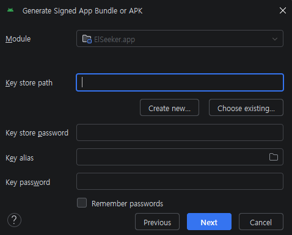
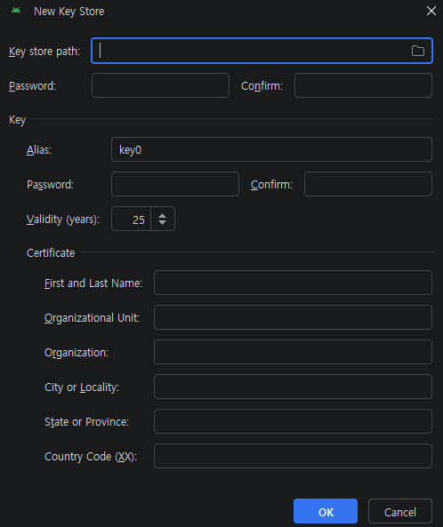

# ElSeeker Android App - 서명 및 AAB 빌드 가이드

Google Play Store에 업로드하려면 **서명된(signed) Android App Bundle(`.aab`)** 이 필요하다. 이 문서는 Android Studio의 **Generate Signed Bundle** 마법사로 업로드 키스토어를 생성하고 서명 번들을 빌드하는 절차를 정리한다.

> **요약 흐름**
> `Build > Generate Signed Bundle / APK` → 번들 정보 입력 → 키스토어 생성/선택 → 빌드 변형(release) 선택 → `app-release.aab` 생성

---

## 1. 사전 준비

| 항목 | 값 |
|------|------|
| 패키지 이름 (`applicationId`) | `com.elseeker.android` |
| 빌드 산출물 | `app/release/app-release.aab` (마법사 기본 대상 폴더) |
| 빌드 도구 | Android Studio Ladybug 이상 (Windows) |

> ⚠️ **WSL 환경에서는 빌드 불가** — Android SDK·build-tools가 Windows에 설치되어 있고 `gradlew`가 없으므로, 서명·빌드는 **Windows의 Android Studio**에서 수행한다.

---

## 2. Generate Signed App Bundle 마법사 실행

Android Studio 메뉴에서 **`Build > Generate Signed Bundle / APK...`** 를 선택하고 **Android App Bundle** 을 고르면 아래 대화상자가 나타난다.



| 필드 | 설명 | 입력 값 |
|------|------|---------|
| **Module** | 서명할 모듈 | `ElSeeker.app` |
| **Key store path** | 키스토어(`.jks`) 파일 경로 | 최초 1회는 비워두고 **Create new...** 클릭 |
| **Create new...** | 새 업로드 키스토어 생성 | → 3장으로 이동 |
| **Choose existing...** | 기존 키스토어 선택 | 2회차부터 사용 |
| **Key store password** | 키스토어 비밀번호 | 키스토어 생성 시 정한 값 |
| **Key alias** | 서명 키 별칭 | 예: `elseeker` |
| **Key password** | 키 비밀번호 | 키 생성 시 정한 값 |
| **Remember passwords** | 비밀번호 기억 | 개인 PC에서만 체크 권장 |

> 최초 릴리즈라면 키스토어가 없으므로 **Create new...** 를 눌러 3장으로 진행한다.

---

## 3. New Key Store - 업로드 키스토어 생성

**Create new...** 를 누르면 새 키스토어를 만드는 대화상자가 나타난다. 여기서 생성한 `.jks` 파일이 **앱 서명의 신뢰 기준**이 되므로 분실하면 동일 키로 업데이트할 수 없다.



### Key store

| 필드 | 설명 | 권장 입력 |
|------|------|-----------|
| **Key store path** | 생성할 `.jks` 파일 경로 | 예: `keystore/elseeker-release.jks` |
| **Password / Confirm** | 키스토어 비밀번호 | 강력한 비밀번호 (분실 주의) |

### Key

| 필드 | 설명 | 권장 입력 |
|------|------|-----------|
| **Alias** | 키 별칭 (기본 `key0`) | `elseeker` |
| **Password / Confirm** | 키 비밀번호 | 강력한 비밀번호 |
| **Validity (years)** | 키 유효 기간 | **25년 이상** (Play 권장: 2046-10-22 이후 만료) |

### Certificate (인증서 정보)

| 필드 | 설명 | 예시 |
|------|------|------|
| **First and Last Name** | 이름 / 조직 대표명 | ElSeeker |
| **Organizational Unit** | 조직 단위 | Mobile |
| **Organization** | 조직명 | ElSeeker |
| **City or Locality** | 도시 | 인천광역시 |
| **State or Province** | 도/주 | 인천광역시 |
| **Country Code (XX)** | 국가 코드 | `KR` |

> 인증서 정보는 식별용이며 모든 필드를 채울 필요는 없지만, 조직/국가 코드는 입력을 권장한다.

**OK** 를 누르면 키스토어가 생성되고, 2장 대화상자의 경로·별칭·비밀번호 필드가 자동으로 채워진다.

---

## 4. 빌드 변형 선택 및 완료

1. 2장 대화상자에서 **Next** 클릭
2. **Destination folder** 확인 (기본값: 모듈 폴더 `app/`)
3. **Build Variants** 에서 `release` 선택
4. **Finish** 클릭 → 서명된 번들 생성

빌드가 끝나면 우측 하단 알림의 **locate** 링크로 산출물을 열 수 있으며, 기본 대상 폴더 기준 경로는 다음과 같다.

```
app/release/app-release.aab
```

> 마법사 대신 CLI(`gradlew.bat bundleRelease`)로 빌드하면 산출물은 `app/build/outputs/bundle/release/app-release.aab` 에 생성된다 (출력 경로가 다름).

이 파일을 [Google Play Console](https://play.google.com/console) 의 **프로덕션 > 새 버전 만들기** 에 업로드한다.

> **네이티브 디버그 기호** — 앱이 네이티브 라이브러리(예: Compose의 `libandroidx.graphics.path.so`)를 포함하면 Play Console이 *"디버그 기호가 업로드되지 않았습니다"* 경고를 표시한다. `app/build.gradle.kts` 의 release 블록에 아래 설정을 추가하면 기호가 AAB에 포함되어 경고가 사라지고, 네이티브 크래시/ANR을 심볼화된 스택으로 분석할 수 있다 (선택사항이지만 권장).
>
> ```kotlin
> release {
>     // ...
>     ndk {
>         debugSymbolLevel = "FULL"   // 전체 스택+파일/라인. 용량 절약 시 "SYMBOL_TABLE"
>     }
> }
> ```

---

## 5. 보안 주의사항

- 🔐 **키스토어(`.jks`)와 비밀번호는 절대 Git에 커밋하지 않는다.** `.gitignore` 에 `*.jks`, `keystore/`, `*.properties`(비밀번호 포함 시) 를 추가한다.
- 💾 키스토어 파일과 비밀번호를 **안전한 별도 백업**(비밀번호 관리자 등)에 보관한다. 분실 시 동일 앱으로 업데이트가 불가능하다.
- ☁️ **Play App Signing** 사용 시 업로드 키와 앱 서명 키가 분리되어, 업로드 키 분실 시 Google 지원으로 재설정할 수 있다. 신규 앱은 활성화를 권장한다.

---

## 참고

- 자동화/CI 빌드가 필요하면 `app/build.gradle.kts` 에 `signingConfig` 를 추가하고 `local.properties` 로 비밀번호를 주입해 `./gradlew bundleRelease` 로 서명 번들을 생성할 수 있다. (현재 프로젝트에는 `signingConfig` 미설정)
- 관련 문서: [android-app-spec.md](android-app-spec.md), [android-app-architecture.md](android-app-architecture.md)
